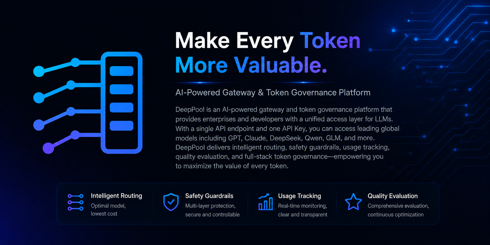

<p align="center">
  <h1 align="center"> DeepPool</h1>
  <p align="center"></p>
  <p align="center">
    <strong>AI Orchestration Gateway & Token Governance Platform</strong>
  </p>
  <p align="center">
    A unified gateway to the world's leading LLMs — intelligent routing, request tracing & evaluation, guardrails, and token governance in one platform.
  </p>
  <p align="center">
    <a href="https://deeppool.tech">🌐 Try DeepPool</a> •
    <a href="#quick-start">Quick Start</a> •
    <a href="#  -overview">Architecture</a> •
    <a href="#project-structure">Project Structure</a> •
    <a href="#deployment">Deployment</a> •
    <a href="#api-documentation">API Docs</a> •
    <a href="#contributing">Contributing</a>
  </p>
</p>

---

## Introduction
DeepPool is an **AI Orchestration Gateway and Token Governance Platform** that provides a unified access layer for large language models. With a single API endpoint and a single API Key, you can call GPT, Claude, DeepSeek, Qwen, GLM, and other leading LLMs worldwide, along with intelligent routing, guardrails, usage tracking, quality evaluation, and comprehensive token governance.

### Core Capabilities

- 🔀 **Multi-Model Orchestration, Unified Gateway** — Access dozens of LLMs through a single API endpoint. Supports three model sources — DeepNode local inference, cloud Provider APIs, and Hybrid orchestration — completely transparent to callers
- 🎯 **Custom Orchestration Policies** — Define Hybrid routing rules via YAML configuration with intelligent dispatching by context length, Function Call, vision content, reasoning requirements, etc. Round-Robin load balancing + automatic failover
- 📊 **Request Tracing, AI Evaluation & Analysis** — Complete inference request/response logging, human annotation feedback & expected output, AI Judge auto-evaluation of model output quality, data-driven continuous optimization
- 🛡️ **Guardrails** — LLM-based input/output content safety evaluation, pre-request interception and post-response auditing, configurable block or log-only policies, ensuring AI application security and compliance
- 🖥️ **DeepNode Local Inference** — Download and install the DeepNode desktop client, deploy open-source models like Qwen, Gemma with one click, leverage local GPU/Apple Silicon for inference compute, data stays on-device

### More Features

- **OpenAI API Fully Compatible** — Standard `/v1/chat/completions` interface, supports streaming SSE, Function Calling, Reasoning Content, zero-modification SDK integration
- **API Key + Rate Limiting + Quota** — SHA-256 authentication, sliding window RPM/TPM rate limiting, Token quota management, AES-256-GCM key encryption
- **Token Usage Governance** — Usage statistics, cost analysis, tiered billing by API Key / model / time dimensions
- **Multi-Inference Engine Support** — MLX (Apple Metal), vLLM (CUDA), llama.cpp (CPU), auto-detect and select optimal engine
- **gRPC Bidirectional Stream Tunnel** — Single TCP long connection carrying registration/heartbeat/task/result, easy NAT traversal
- **Security Design** — Parameterized queries, bcrypt password hashing, Token authentication, input validation

---

## Architecture Overview

```
┌──────────────────────────────────────────────────────────────┐
│                      External Callers                         │
│              POST /v1/chat/completions                        │
└─────────────────────────┬────────────────────────────────────┘
                          │ HTTP (OpenAI API, Bearer API Key)
                          ▼
┌──────────────────────────────────────────────────────────────┐
│              DeepPool Gateway (AI Orchestration Gateway)      │
│                                                              │
│  ┌──────────────────────────────────────────────────────┐   │
│  │                   Request Pipeline                    │   │
│  │  Auth → RateLimit → Quota → Guardrails(Input)        │   │
│  │    → Route → Inference → Guardrails(Output) → Trace  │   │
│  └──────────────────────────────────────────────────────┘   │
│                                                              │
│  ┌────────────┐ ┌─────────────┐ ┌─────────────────┐        │
│  │  DeepNode   │ │  Provider   │ │    Hybrid       │        │
│  │  Local      │ │  Cloud API  │ │  Orchestration  │        │
│  │  gRPC →     │ │  HTTP →     │ │  Conditional    │        │
│  │  NodeMgr    │ │  Cloud API  │ │  Route +        │        │
│  │             │ │             │ │  Round-Robin +   │        │
│  │             │ │             │ │  Failover        │        │
│  └──────┬──────┘ └──────┬──────┘ └────────┬────────┘        │
│         │               │                 │                  │
│  ┌──────────────────────────────────────────────────────┐   │
│  │  Token Governance Layer                               │   │
│  │  Usage Stats · Cost Analysis · Tracing · AI Eval ·   │   │
│  │  Guardrails                                          │   │
│  └──────────────────────────────────────────────────────┘   │
│                                                              │
│  User Management · Model Registry · API Key Mgmt · Wallet   │
│                        ┌──────────────┐                      │
│                        │   MySQL 8    │                      │
│                        │  Data Store  │                      │
│                        └──────────────┘                      │
└────────────┬───────────────┬─────────────────────────────────┘
             │ gRPC          │ HTTPS
             ▼               ▼
┌────────────────────┐  ┌─────────────────────┐
│  NodeManager ×N    │  │  Cloud APIs          │
│  Shard Conn Table  │  │  OpenAI / Claude     │
│  Least-Conn Sched  │  │  DeepSeek / Qwen     │
│  gRPC Tunnel Mgmt  │  │  GLM / Kimi / ...    │
└────────┬───────────┘  └─────────────────────┘
         │ gRPC Bidirectional Stream
         ▼
┌─────────────────────────────────────────────────────┐
│              DeepNode (Desktop Client)               │
│  Local deployment of Qwen, Gemma, and other         │
│  open-source models                                  │
│                                                     │
│  ┌───────────┐  ┌───────────┐  ┌────────────────┐  │
│  │  Tauri UI  │  │  FastAPI   │  │ Inference      │  │
│  │  Vue 3     │  │  :8765     │  │ Engine         │  │
│  │            │  │            │  │ MLX/vLLM/GGUF  │  │
│  └───────────┘  └───────────┘  └────────────────┘  │
└─────────────────────────────────────────────────────┘
```

### Gateway Capability Matrix

| Capability | Description |
|-----------|-------------|
| **Orchestration** | Unified access to DeepNode / Provider / Hybrid model sources with intelligent routing |
| **Custom Policies** | YAML-configured conditional routing rules, dispatch by request characteristics to optimal sub-model |
| **Trace** | Complete inference request/response logging, filterable by API Key, model, time |
| **AI Evaluation** | AI Judge auto-evaluation + human annotation feedback, data-driven quality optimization |
| **Guardrails** | LLM-driven input/output safety guardrails, supporting block and audit modes |
| **Token Governance** | Usage statistics, quota management, tiered billing, cost analysis |

### Model Three-Tier Classification

| VendorType | Description | Routing |
|-----------|-------------|---------|
| **deepnode** | Local device inference (Qwen, Gemma, etc.) | Gateway → gRPC → NodeManager → Device Tunnel |
| **provider** | Cloud API (OpenAI, Claude, DeepSeek, etc.) | Gateway → HTTP Proxy → Cloud API |
| **hybrid** | Orchestration (combining multiple sub-models) | Conditional Routing + Round-Robin + Auto Failover |

---

## Project Structure

```
DeepPool/
├── libs/                          # Shared protocol layer
│   └── proto/                     # Protobuf definitions + generated code
│       ├── llm_infer.proto        #   LLM inference protocol (OpenAI-aligned)
│       ├── manager_service.proto  #   Manager service protocol
│       └── node_tunnel.proto      #   Device tunnel bidirectional stream protocol
│
├── platform/                      # Platform backend + Web frontend
│   ├── cmd/
│   │   ├── manager/               #   Manager service entry
│   │   ├── nodemanager/           #   NodeManager service entry
│   │   └── experiment/            #   Experiment service entry
│   ├── internal/
│   │   ├── config/                #   Unified config loading
│   │   ├── common/                #   Shared middleware, error codes, response wrapping
│   │   ├── storage/mysql/         #   MySQL connection pool + idempotent table creation
│   │   ├── modules/health/        #   Health check module
│   │   ├── manager/               #   Manager business logic (handler/service/repository)
│   │   └── nodemanager/           #   NodeManager business logic (tunnel/dispatch/OpenAI)
│   ├── config/                    #   YAML config files
│   ├── control_web/               #   Admin dashboard frontend (Vue 3 + TDesign)
│   ├── portal_web/               #   User portal frontend (Vue 3 + TDesign)
│   └── deploy.sh                  #   Unified remote deployment script
│
├── clients/
│   └── deepnode/                  # DeepNode desktop client
│       ├── app/                   #   Frontend UI (Vue 3 + TypeScript)
│       ├── src-tauri/             #   Tauri 2.0 native layer (Rust)
│       └── localserver/           #   Local inference service (Python 3.13 + FastAPI)
│
├── build.sh                       # Full build script
├── dev.sh                         # Dev mode launcher
├── go.work                        # Go Workspace
└── package.json                   # npm Workspace
```

---

## Tech Stack

| Layer | Technology |
|-------|-----------|
| **Platform Backend** | Go 1.23, stdlib `net/http` (zero framework), gRPC |
| **Inference Gateway** | Gateway-embedded Manager, API Key auth (SHA-256), sliding window rate limiting (RPM/TPM), quota management, Guardrails |
| **Database** | MySQL 8 (InnoDB, utf8mb4_unicode_ci) |
| **Serialization / RPC** | Protocol Buffers 3, gRPC (with bidirectional streams) |
| **Cryptography** | bcrypt (passwords), AES-256-GCM (API Key encryption), SHA-256 (device fingerprint + API Key hash) |
| **Admin Frontend** | Vue 3 + TDesign + Pinia + Tailwind CSS |
| **Portal Frontend** | Vue 3 + TDesign + markdown-it + vue-i18n |
| **Desktop Client** | Tauri 2.0 (Rust) + Vue 3 + TypeScript |
| **Local Inference Service** | Python 3.13, FastAPI + uvicorn, grpcio |
| **Inference Engines** | MLX (Apple Metal), vLLM (CUDA), llama.cpp (CPU) |
| **Function Call** | Registry-architecture ToolCallParser (supports GLM/Kimi/DeepSeek/Qwen/Gemma4/Llama/Mistral) |
| **Model Management** | HuggingFace Hub (with mirror support) |

---

## Quick Start

### Prerequisites

| Dependency | Version | Purpose |
|-----------|---------|---------|
| **Go** | ≥ 1.23 | Platform backend compilation |
| **Node.js** | ≥ 18 | Frontend build |
| **MySQL** | ≥ 8.0 | Data storage |
| **Python** | ≥ 3.13 | DeepNode local inference service |
| **protoc** | ≥ 3.x | Protobuf compilation (only needed when modifying proto) |
| **Rust / Cargo** | latest stable | Tauri desktop client build (optional) |

### 1. Clone Repository

```bash
git clone https://github.com/BiyoTech/Public-DeepPool.git
cd DeepPool
```

### 2. Prepare Database

Create a MySQL database (tables are auto-created on service startup):

```sql
CREATE DATABASE deeppool CHARACTER SET utf8mb4 COLLATE utf8mb4_unicode_ci;
```

### 3. Configure

Edit the platform configuration file with your database connection info:

```bash
# Edit Manager config
vim platform/config/manager.yaml
```

```yaml
server:
  http_addr: ":8080"
  grpc_addr: ":9090"

mysql:
  host: "127.0.0.1"
  port: 3306
  user: "root"
  password: "your_password"
  database: "deeppool"
```

> **Tip**: NodeManager config structure is similar, located at `platform/config/nodemanager.yaml`.

### 4. Start Platform Services

**Option A: One-click dev mode (recommended)**

```bash
# Start all platform components + frontend dev servers + DeepNode client
./dev.sh all
```

`dev.sh` supports module-based startup:

```bash
./dev.sh platform      # Start backend services only (Manager)
./dev.sh platformweb   # Start frontend dev servers only
./dev.sh client        # Start DeepNode client only
./dev.sh all           # Start everything (default)
```

**Option B: Start backend components individually**

Use `run_platformserver.sh` to start specific backend services:

```bash
# Terminal 1 — Start Manager (default)
./run_platformserver.sh manager

# Terminal 2 — Start NodeManager
./run_platformserver.sh nodemanager

# Terminal 3 — Start Experiment
./run_platformserver.sh experiment
```

> Supports `DEEPPOOL_LOG_LEVEL` environment variable to control log level (default: `debug`).

**Option C: Start frontend dev servers individually**

Use `run_platformweb.sh` to start frontends:

```bash
# Start both admin dashboard + user portal (default)
./run_platformweb.sh all

# Start admin dashboard only (port 5173)
./run_platformweb.sh control

# Start user portal only (port 5174)
./run_platformweb.sh portal
```

| Frontend | Port | Description |
|----------|------|-------------|
| control_web | 5173 | Admin dashboard (for administrators) |
| portal_web | 5174 | User portal (for end users) |

### 5. Verify Services

```bash
# Health check
curl http://localhost:8080/api/v1/health
# Expected: {"code":0,"message":"ok","data":{"status":"healthy"}}

curl http://localhost:8082/api/v1/health
# Expected: {"code":0,"message":"ok","data":{"status":"healthy"}}
```

### 6. Start DeepNode Client (Device Node)

```bash
cd clients/deepnode

# Create Python virtual environment and install dependencies
python3.13 -m venv venv
source venv/bin/activate
pip install -r localserver/requirements.txt

# Start local inference service
cd localserver && python main.py &

# Start Tauri desktop app (requires Rust)
cd ../app && npm install
cd .. && cargo tauri dev
```

> **Standalone mode** (no Tauri, browser access):
> ```bash
> cd clients/deepnode
> ./run_standalone.sh
> ```

---

## API Documentation

DeepPool exposes an **OpenAI-compatible** inference interface. Existing OpenAI SDKs can integrate with zero cost. Supports three model types: `deepnode` (edge device inference), `provider` (cloud API proxy), `hybrid` (intelligent orchestration).

### Chat Completions

```bash
# Non-streaming request
curl http://localhost:8080/v1/chat/completions \
  -H "Content-Type: application/json" \
  -H "Authorization: Bearer <your-api-key>" \
  -d '{
    "model": "Qwen/Qwen3-0.6B-8bit",
    "messages": [
      {"role": "user", "content": "Hello, please introduce yourself"}
    ],
    "stream": false
  }'
```

```bash
# Streaming request (SSE)
curl http://localhost:8080/v1/chat/completions \
  -H "Content-Type: application/json" \
  -H "Authorization: Bearer <your-api-key>" \
  -d '{
    "model": "Qwen/Qwen3-0.6B-8bit",
    "messages": [
      {"role": "user", "content": "Write a poem about distributed computing"}
    ],
    "stream": true
  }'
```

### Using OpenAI Python SDK

```python
from openai import OpenAI

client = OpenAI(
    base_url="http://localhost:8080/v1",
    api_key="your-api-key",
)

response = client.chat.completions.create(
    model="Qwen/Qwen3-0.6B-8bit",
    messages=[{"role": "user", "content": "Hello!"}],
    stream=True,
)

for chunk in response:
    if chunk.choices[0].delta.content:
        print(chunk.choices[0].delta.content, end="")
```

### List Available Models

```bash
curl http://localhost:8080/v1/models \
  -H "Authorization: Bearer <your-api-key>"
```

---

## Build

The project provides a unified build script with module-based build support:

```bash
# Build all components
./build.sh all

# Only regenerate Protobuf code
./build.sh proto

# Only build platform backend services
./build.sh backend

# Only build web frontends (portal_web + control_web)
./build.sh web
```

### Build Artifacts

```
dist/
└── platform/
    ├── manager           # Manager binary
    ├── nodemanager       # NodeManager binary
    ├── experiment        # Experiment binary
    ├── portal_web/       # Portal frontend assets
    └── control_web/      # Admin frontend assets
```

---

## Deployment

### Unified Deployment Script

The project provides a unified `deploy.sh` script with flexible parameter-based deployment control:

```bash
cd platform

# View help
./deploy.sh --help

# Production full deployment (local SSL cert + password auth)
./deploy.sh --domain deeppool.tech --server root@<your-server-ip> --password '<your-password>' \
            --config config_prod --ssl local --ssl-cert-dir ssl_cert

# Test environment full deployment (Let's Encrypt auto cert + SSH Key auth)
./deploy.sh --domain test.deeppool.tech --server root@<your-server-ip> \
            --config config_test --ssl letsencrypt

# Deploy manager and portal_web only
./deploy.sh --domain deeppool.tech --server root@<your-server-ip> --password '<your-password>' \
            --components manager,portal_web

# Deploy frontends only
./deploy.sh --domain deeppool.tech --server root@<your-server-ip> --password '<your-password>' \
            --components portal_web,control_web
```

### Deployment Parameters

| Parameter | Required | Description | Default |
|-----------|:--------:|-------------|---------|
| `--domain` | ✅ | Deployment domain | — |
| `--server` | ✅ | Remote server `user@host` | — |
| `--password` | — | SSH password (omit for Key auth) | — |
| `--config` | — | Config directory name (relative to `platform/`) | `config_prod` |
| `--remote-dir` | — | Remote deployment directory | `/opt/deeppool` |
| `--components` | — | Comma-separated component list | all |
| `--ssl` | — | Cert mode: `local` / `letsencrypt` | auto-detect |
| `--ssl-cert-dir` | — | Local certificate directory | `ssl_cert` |
| `--admin-email` | — | Let's Encrypt registration email | `admin@deeppool.tech` |

**Deployable components**: `manager`, `nodemanager`, `experiment`, `portal_web`, `control_web`

### Deployment Flow

The script automatically completes the following steps:

1. **Cross-compilation** — Go services compiled to `linux/amd64` binary (`-trimpath -ldflags="-s -w"`)
2. **Frontend Build** — Vite production build for `control_web` (base=/admin/) and `portal_web`
3. **Stop Old Services** — Remote SIGTERM → wait → SIGKILL graceful shutdown
4. **Upload Artifacts** — SCP upload binaries, configs, frontend assets, SSL certs, payment certs
5. **SSL Certificates** — Local cert upload or Let's Encrypt auto-provisioning (with renewal cron)
6. **Start Services** — nohup background startup for all backend components
7. **Nginx Config** — Auto-generate and load Ingress config (HTTPS termination + reverse proxy)
8. **Health Check** — Verify service port listening and HTTP response

### Nginx Ingress Routes

| Domain | Path | Backend |
|--------|------|---------|
| `deeppool.tech` | `/` | portal_web (User Portal) |
| `deeppool.tech` | `/admin/` | control_web (Admin Dashboard) |
| `deeppool.tech` | `/api/` | Manager :8080 |
| `deeppool.tech` | `/v1/` | Manager :8080 (Gateway SSE) |
| `api.deeppool.tech` | `/api/` `/v1/` | Manager :8080 (Dedicated API domain) |

### Post-Deployment Directory Structure

```
/opt/deeppool/               # Remote server
├── manager                  # Manager binary
├── nodemanager              # NodeManager binary
├── experiment               # Experiment binary
├── manager.log              # Manager runtime log
├── nodemanager.log          # NodeManager runtime log
├── experiment.log           # Experiment runtime log
├── config/                  # YAML config files
│   ├── manager.yaml
│   ├── nodemanager.yaml
│   └── experiment.yaml
├── control_web/             # Admin dashboard frontend assets
├── portal_web/              # User portal frontend assets
├── alipay_cert/             # Alipay certificates
└── wechat_pay_cert/         # WeChat Pay certificates
```

### Port Reference

| Service | HTTP | gRPC | Description |
|---------|------|------|-------------|
| Manager | 8080 | 9090 | User/Device management + **AI Orchestration Gateway** |
| NodeManager | 8082 | 9092 | Device tunnel management + inference dispatch |
| Experiment | — | 9093 | AI Judge + dataset evaluation |
| control_web (Nginx) | 443 | — | Admin Dashboard (`/admin/`) |
| portal_web (Nginx) | 443 | — | User Portal (`/`) |
| DeepNode LocalServer | 8765 | — | Local inference service |

---

## Database

Uses MySQL 8. Core tables are **idempotently created** on service startup. Incremental changes are managed via SQL scripts in the `migrations/` directory.

### Database Migrations

The project provides an `update_db.sh` script to execute incremental SQL migrations from `platform/migrations/`:

```bash
cd platform

# View help
./update_db.sh --help

# Read DB connection from config file, execute all migrations
./update_db.sh --config config/manager.yaml

# Manually specify connection parameters
./update_db.sh --host 127.0.0.1 --user root --password 'your_password' --database deeppool

# Execute only specified migration file
./update_db.sh --config config/manager.yaml --file 011_guardrails.sql

# Start from specified migration number
./update_db.sh --config config/manager.yaml --from 008

# Preview files to be executed (dry run)
./update_db.sh --config config/manager.yaml --dry-run
```

**Migration Rules**:
- SQL files are executed in order of filename prefix number (002, 003, 004, ...)
- All statements use idempotent patterns like `CREATE TABLE IF NOT EXISTS`, `ALTER TABLE ... ADD COLUMN IF NOT EXISTS`, safe to re-execute
- Execution auto-stops on failure with a command hint to resume from the failed file

### Migration Files

```
platform/migrations/
├── 002_billing_precision_yuan.sql        # Billing precision adjusted to yuan
├── 003_tunnel_logs_fen_to_yuan.sql       # Tunnel log amount fen → yuan
├── 004_add_model_tags.sql                # Model tags field
├── 005_payment_orders.sql                # Payment orders table
├── 006_consumer_operations.sql           # Consumer operation records
├── 007_add_supports_vision.sql           # Vision capability flag
├── 008_user_custom_models.sql            # User custom models
├── 009_migrate_rename_model_family.sql   # Model family rename
├── 010_remove_legacy_provider_fields.sql # Remove legacy Provider fields
└── 011_guardrails.sql                    # Guardrails tables
```

### Core Tables Overview

| Table | Description | Key Fields |
|-------|-------------|------------|
| `users` | Users | username (UK), password_hash, phone (UK), email (UK) |
| `user_sessions` | Sessions | token (UK) → user_id, expires_at (7-day validity) |
| `user_devices` | Devices | simei (UK), user_id, device_ip, device_config (JSON) |
| `api_keys` | API Keys | key_hash (UK), user_id, rate_limit, quota |
| `model_registry` | Model Registry | model_name (UK), vendor_type, pricing_tiers (JSON) |
| `model_endpoints` | Model Endpoints | model_id → endpoint, upstream_model |
| `user_custom_models` | User Custom Models | user_id + model_name (UK), hybrid_policy (TEXT) |
| `guardrails` | Guardrail Rules | api_key_id, phase, action, evaluator_model |
| `guardrail_results` | Guardrail Evaluation Results | guardrail_id, request_id, flagged, blocked |
| `payment_orders` | Payment Orders | order_no (UK), user_id, amount, status |

---

## Testing

```bash
# Run platform backend unit tests
cd platform
go test ./...

# Run specific module tests
go test ./internal/nodemanager/...
go test ./internal/manager/...
```

The project includes the following test suites:
- **ConnectionHub** — Sharded concurrent register/unregister/lookup
- **OpenAI Handler** — Request parsing and response wrapping
- **User Handler** — HTTP interface tests
- **User Service** — Business logic tests

> 📝 Full integration test manual available at [mini_test.md](./mini_test.md), covering user registration/login, model configuration, device initialization, gRPC inference (streaming/non-streaming/multi-turn), OpenAI-compatible interface, and other end-to-end scenarios.

---

## Contributing

Contributions to DeepPool are welcome!

### Development Workflow

1. **Fork** this repository
2. Create a feature branch: `git checkout -b feature/your-feature`
3. Commit changes: `git commit -m 'feat: add some feature'`
4. Push branch: `git push origin feature/your-feature`
5. Submit a **Pull Request**

### Code Standards

- **Go** — Follow standard Go coding conventions, `gofmt` formatted
- **Frontend** — Vue 3 Composition API + TypeScript
- **Commit Messages** — Follow [Conventional Commits](https://www.conventionalcommits.org/)
- **Security** — All SQL uses parameterized queries, passwords use bcrypt hashing
- **Code Quality** — Focus on good abstraction, add necessary comments and logging

### Recommended Dev Environment

```bash
# One-click dev environment (auto parallel start all components)
./dev.sh all

# Or start in separate terminals for easier log viewing
# Terminal 1: Backend
./run_platformserver.sh manager
# Terminal 2: Frontend
./run_platformweb.sh all
# Terminal 3: DeepNode client (optional)
./run_client.sh
```

**Local Dev Scripts**:

| Script | Purpose | Parameters |
|--------|---------|------------|
| `dev.sh` | One-click start all components | `platform` / `platformweb` / `client` / `all` |
| `run_platformserver.sh` | Start backend services | `manager` / `nodemanager` / `experiment` |
| `run_platformweb.sh` | Start frontend dev servers | `control` / `portal` / `all` |
| `run_client.sh` | Start DeepNode client | — |

---

## License

This project is licensed under the [Apache License 2.0](LICENSE).

---

<p align="center">
  <sub>Built with ❤️ by the DeepPool Team</sub>
</p>
